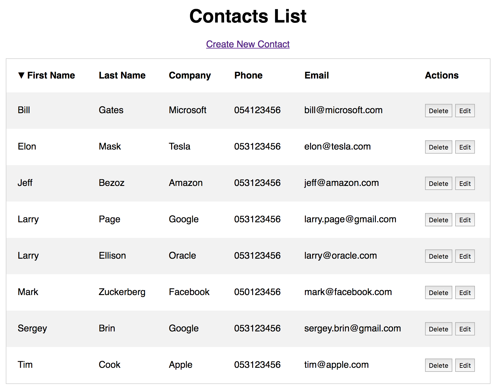

# CRUD Contacts App
CRUD (create, read, update, delete) contacts web application made with ReactJS and Redux.

    $ git clone https://github.com/leon-good-life/reactCRUD.git
    $ cd reactCRUD
    $ npm install
    $ npm start

# Same app with other frameworks
I developed the same app with Angular 2 and Redux:
[https://github.com/leon-good-life/ngCRUD](https://github.com/leon-good-life/ngCRUD)

# Backend
I developed a backend using nodeJS/expressJS and MongoDB for this app:
[https://github.com/leon-good-life/smallProjects/tree/master/contacts-backend](https://github.com/leon-good-life/smallProjects/tree/master/contacts-backend)

# screenshots:

